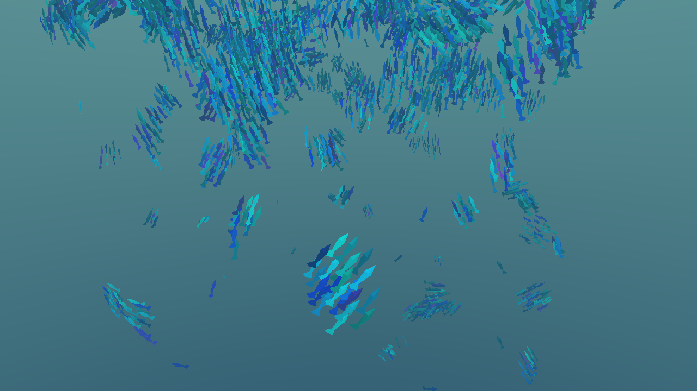
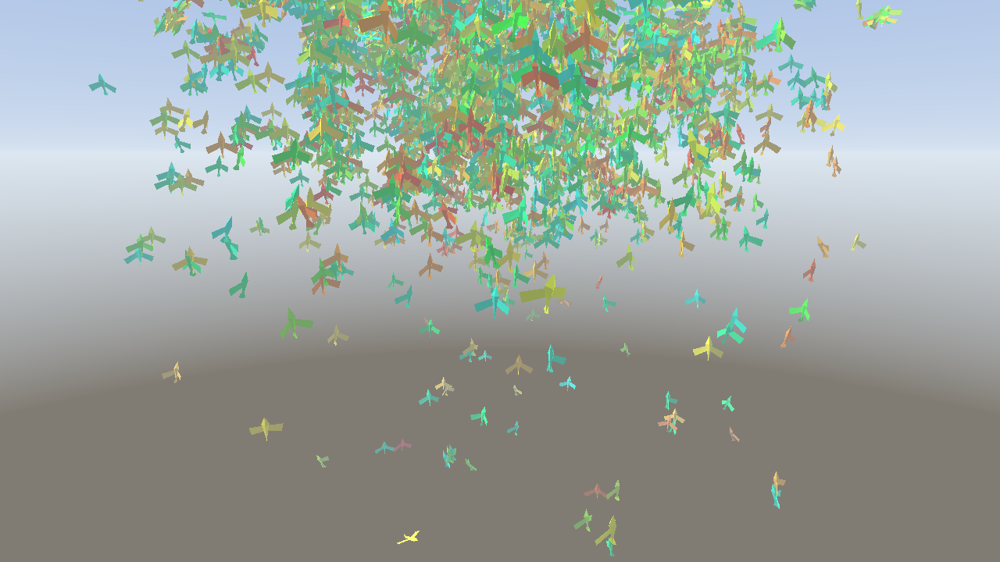

# boids

GPU flocking simulation in pure Rust + `wgpu`: 50k-100k agents, two procedural worlds, and a cursor
that pushes the swarm around.

Day 1 of a four-day sprint is done. See [Status](#status) for exactly what runs today and
[PLAN.md](PLAN.md) for the full plan.




## Requirements

* Rust 1.80 or newer (developed on 1.97).
* A GPU with compute shader support. Vulkan on Linux/NVIDIA is the target; the app also runs on a
  software adapter (llvmpipe/lavapipe) at reduced agent counts, which is how the test suite runs in a
  container.
* A window system for the interactive app. The screenshot mode and every test need neither.

## Build and run

```bash
cargo build --release
./target/release/boids                    # 4096 agents, underwater
./target/release/boids --birds            # sky world
./target/release/boids --agents 200000    # more agents (see Status: needs the day-2 grid)
./target/release/boids --help
```

Write a frame to a PNG without opening a window, which is also the visual regression entry point:

```bash
./target/release/boids --fish  --agents 3000 --screenshot docs/screenshots/day1-fish.png
./target/release/boids --birds --agents 3000 --screenshot docs/screenshots/day1-birds.png
```

### Controls

| Input | Action |
|---|---|
| left drag | orbit the camera |
| right drag | pan |
| wheel | zoom |
| `1` | cursor attracts the swarm |
| `2` | cursor repels and swirls the swarm |
| `0` | cursor influence off |
| middle drag | momentary attractor, without changing the selected mode |
| `tab` | switch between the underwater and sky worlds |
| `space` | pause |
| `r` | respawn the swarm |
| `esc` | quit |

## Tests

```bash
cargo test --workspace          # CPU unit tests, the GPU suite and the render checks
cargo test -p boids-gpu  --test gpu -- --list
cargo test -p boids-render --test render_suite
BOIDS_TEST_REQUIRE_GPU=1 cargo test --workspace   # fail instead of using a software adapter
```

The GPU suites are hand-rolled binaries with `harness = false` rather than `#[test]` functions. Two
concrete reasons, both documented at the top of `crates/boids-gpu/tests/gpu/main.rs`: `libtest` runs
each test in its own thread, and creating then dropping a GL-backed `wgpu` device off the main thread
crashes the process at exit on this driver; and creating a device per test is wasteful when one device
can serve the whole run.

What the suites actually assert:

| Check | What it catches |
|---|---|
| `shaders/compile_all` | a shader that does not compile, found at test time rather than at startup |
| `layout/wgsl_offsets_match_rust` | a struct field at a different offset in WGSL than in Rust |
| `layout/struct_sizes_are_exact` | a struct that grew past the size its WGSL mirror assumes |
| `reference/one_step_matches_cpu` | any drift in the force model, agent by agent, after one step |
| `reference/many_steps_match_cpu_aggregates` | a systematic dynamic difference that per-agent comparison would miss |
| `reference/swarm_polarises_on_gpu` | a swarm that moves but never forms flocks |
| `grid/unprepared_finds_no_neighbours` | a grid pass reading uninitialised memory |
| `render/background_has_structure` | a missing backdrop pass, or a flipped Y in the ray reconstruction |
| `render/agents_contribute_pixels` | a mesh function or instanced draw producing nothing |
| `render/depth_is_written` | geometry rejected by the depth test (skipped where the backend cannot copy depth) |
| `render/worlds_look_different` | a stale scene uniform, so the mode never reaches the shaders |

The `layout/wgsl_offsets_match_rust` check is the most valuable one in the project. A layout mismatch
does not crash, does not produce an obviously wrong picture, and is nearly invisible in a diff: the
simulation just behaves subtly wrong because `r_percept` on the host is `w_coh` on the device.

## Status

Day 1 complete:

* fully GPU-resident simulation: ping-pong agent buffers, one compute pass per frame, no CPU loop over
  agents,
* the agent mesh and its orientation basis are generated in the vertex shader from `vertex_index` and
  the agent's velocity. There is no vertex buffer and no instance buffer,
* both worlds render: a procedural sky/water backdrop, mode-specific mesh and medium parameters, and a
  `tab` switch that reallocates nothing,
* cursor interaction: attract, repel with swirl, and a momentary override on the middle button,
* headless screenshot mode.

Not yet:

* **the spatial grid**. Today the neighbour search is all-pairs, which is exact and O(N^2). 4096 agents
  run at ~48 fps at 1440p on a *software* adapter; 16k agents is roughly sixteen times slower. The
  grid, its bitonic sort and the range-building pass are day 2, and that is what unlocks the 50k-100k
  target. The app warns loudly when the agent count crosses the point where all-pairs stops being the
  right answer.
* environment collision. The avoidance force and the reef and terrain fields exist and are unit
  tested, but `SimConfig::env` is not yet wired to a renderer that draws those surfaces.
* volumetric underwater rendering, god rays, caustics, bloom, and the terrain mesh with its biomes:
  days 3 and 4.

## Documentation

* [PLAN.md](PLAN.md) - the plan, the crate decomposition and the four-day roadmap.
* [docs/architecture.md](docs/architecture.md) - crate responsibilities, frame data flow, and the
  comment standard.
* [docs/gpu-pipeline.md](docs/gpu-pipeline.md) - buffer table, bind group layouts, pass order, dispatch
  sizes.
* [docs/math.md](docs/math.md) - the force model, the SDF gradient, the cursor ray, with derivations.
* [docs/perf.md](docs/perf.md) - measured frame times and what limits them.
* [docs/adr/](docs/adr/) - decisions with their alternatives and consequences.

## Layout

```
crates/
  boids-core/    data contract, CPU reference, camera and ray math, SDF and terrain fields, WGSL loader
  boids-gpu/     device setup, buffers, compute pipelines, the device test suite
  boids-scene/   procedural environments and art content (day 3-4)
  boids-render/  frame graph, passes, PNG output
  boids-app/     window, input, frame loop, CLI, screenshot mode
shaders/         all WGSL, composed with a //#include preprocessor
docs/            architecture, pipeline, math, performance, ADRs
```

## Licence

MIT OR Apache-2.0.
