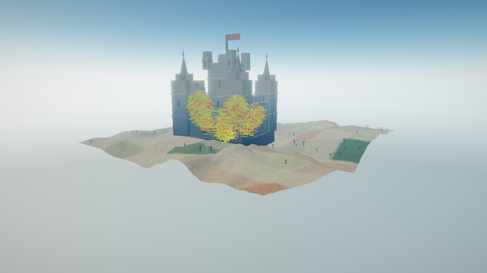

# boids

GPU flocking simulation in pure Rust + `wgpu`: 50k-100k agents, two procedural worlds, and a cursor
that pushes the swarm around.

Days 1-4 of a four-day sprint are done. See [Status](#status) for exactly what runs today and
[PLAN.md](PLAN.md) for the full plan.




## Requirements

* Rust 1.80 or newer (developed on 1.97).
* A GPU with compute shader support. Vulkan on Linux/NVIDIA is the target; the app also runs on a
  software adapter (llvmpipe/lavapipe) at reduced agent counts, which is how the test suite runs in a
  container.
* A window system for the interactive app. The screenshot mode and every test need neither.

## Build and run

```bash
cargo build --release
./target/release/boids                       # 100000 agents, underwater
./target/release/boids --birds               # sky world
./target/release/boids --agents 200000       # more agents (keys pad to the next power of two)
./target/release/boids --strategy naive      # force all-pairs, for an A/B comparison
./target/release/boids --bench 120           # headless per-pass GPU timings, then exit
./target/release/boids --model castle        # open the model viewer on the castle
./target/release/boids --help
```

Write a frame to a PNG without opening a window, which is also the visual regression entry point:

```bash
./target/release/boids --fish  --agents 3000 --screenshot docs/screenshots/day4-fish.png
./target/release/boids --birds --agents 3000 --screenshot docs/screenshots/day4-birds.png
./target/release/boids --model castle --screenshot docs/screenshots/castle.png
```

### Controls

| Input | Action |
|---|---|
| left drag | orbit the camera |
| right drag | pan |
| wheel | zoom |
| `1` | cursor attracts the swarm |
| `2` | cursor repels and swirls the swarm |
| `0` | cursor influence off |
| middle drag | momentary attractor, without changing the selected mode |
| `tab` | switch between the underwater and sky worlds |
| `space` | pause |
| `r` | respawn the swarm |
| `esc` | quit |

The model viewer (`v`) shows one mesh at a time in a studio, through the same pipelines and post chain
the world uses, so a model screenshot cannot drift from what the scene draws:

| Input | Action |
|---|---|
| `v` | open or close the model viewer |
| `1`..`4` | select fish, bird, tree or castle |
| `[` / `]` | step through the models |
| left drag / wheel | rotate and zoom the model |
| `r` | reframe the camera |
| `v` | back to the swarm |

## Tests

```bash
cargo test --workspace          # CPU unit tests, the GPU suite and the render checks
cargo test -p boids-gpu  --test gpu -- --list
cargo test -p boids-render --test render_suite
BOIDS_TEST_REQUIRE_GPU=1 cargo test --workspace   # fail instead of using a software adapter
```

The GPU suites are hand-rolled binaries with `harness = false` rather than `#[test]` functions. Two
concrete reasons, both documented at the top of `crates/boids-gpu/tests/gpu/main.rs`: `libtest` runs
each test in its own thread, and creating then dropping a GL-backed `wgpu` device off the main thread
crashes the process at exit on this driver; and creating a device per test is wasteful when one device
can serve the whole run.

What the suites actually assert:

| Check | What it catches |
|---|---|
| `shaders/compile_all` | a shader that does not compile, found at test time rather than at startup |
| `layout/wgsl_offsets_match_rust` | a struct field at a different offset in WGSL than in Rust |
| `layout/struct_sizes_are_exact` | a struct that grew past the size its WGSL mirror assumes |
| `reference/one_step_matches_cpu` | any drift in the force model, agent by agent, after one step |
| `reference/many_steps_match_cpu_aggregates` | a systematic dynamic difference that per-agent comparison would miss |
| `reference/swarm_polarises_on_gpu` | a swarm that moves but never forms flocks |
| `sort/immediates_reach_the_shader` | sort stage parameters that do not reach the shader, so every stage replays the first |
| `grid/sort_matches_cpu` | a bitonic network or padding rule that does not match a CPU sort |
| `grid/unprepared_finds_no_neighbours` | a grid pass reading uninitialised or stale memory |
| `grid/ranges_are_consistent` | a range array that does not partition the live agents, or a cell left stale |
| `grid/matches_naive` | a grid search that finds a different neighbour set than all-pairs |
| `grid/long_run_matches_naive` | a grid that is right at spawn but loses neighbours as the swarm moves |
| `sdf/wgsl_matches_rust` | a CPU/GPU divergence in the reef or terrain field, or a sign flip |
| `render/background_has_structure` | a missing backdrop pass, or a flipped Y in the ray reconstruction |
| `render/terrain_grounds_the_sky_world` | a terrain mesh with holes (the wrong triangle winding is culled) or no ground pass |
| `render/landmark_is_drawn` | a castle mesh builder that returns nothing, a zero instance count, or binding 9 never reaching the vertex shader |
| `render/agents_contribute_pixels` | a mesh function or instanced draw producing nothing |
| `render/depth_is_written` | geometry rejected by the depth test (skipped where the backend cannot copy depth) |
| `render/worlds_look_different` | a stale scene uniform, so the mode never reaches the shaders |
| `render/ocean_writes_depth` | a raymarch that never hits, a wrong `frag_depth`, or a surface plane in the wrong place |
| `render/underwater_is_blue_and_lit` | a medium that scatters no light, or extinction that is not per channel |
| `render/bloom_adds_light` | a bright pass that thresholds everything away, or a composite that ignores the pyramid |
| `render/focus_marker_is_visible` | an interaction uniform that never reaches the shader, or a marker behind the environment depth |

The `layout/wgsl_offsets_match_rust` check is the most valuable one in the project. A layout mismatch
does not crash, does not produce an obviously wrong picture, and is nearly invisible in a diff: the
simulation just behaves subtly wrong because `r_percept` on the host is `w_coh` on the device.

## Status

Days 1-4 complete, except the world morph:

* fully GPU-resident simulation: ping-pong agent buffers, no CPU loop over agents,
* the agent mesh and its orientation basis are generated in the vertex shader from `vertex_index` and
  the agent's velocity. There is no vertex buffer and no instance buffer,
* both worlds render: a procedural sky backdrop and a raymarched reef, mode-specific mesh and medium
  parameters, and a `tab` switch that reallocates nothing,
* cursor interaction: attract, repel with swirl, and a momentary override on the middle button,
* headless screenshot mode,
* **the spatial grid**: `clear_cells`, `hash`, a 153-stage bitonic sort and `build_ranges` rebuild the
  grid every frame, and `integrate_grid` searches the 27 cells around each agent. 100,000 agents pad to
  131,072 keys, and the grid search is checked against all-pairs agent by agent,
* **strategy selection**: all-pairs below the measured crossover (1,024 agents), the grid above it, and
  `--strategy naive|grid` to force either for an A/B comparison,
* **`--bench`**: headless per-pass GPU timings via timestamp queries, which is where the numbers in
  [docs/perf.md](docs/perf.md) come from,
* **the underwater world**: a half-resolution sphere trace of the simulation's own reef field, shaded
  with per-channel Beer-Lambert extinction and in-scatter, procedural caustics, god rays and
  bioluminescent agents, resolved to full size with depth
  ([ADR-0005](docs/adr/0005-raymarched-environment-with-depth.md)),
* **HDR + bloom + ACES**: every geometry pass writes `Rgba16Float`, a three-level bloom pyramid spreads
  light from the fish and the caustics, and the composite tone maps with ACES
  ([ADR-0004](docs/adr/0004-hdr-intermediate-and-post-chain.md)),
* **cursor focus marker**: the cursor's influence point is drawn into the environment and hidden by
  whatever the raymarch hit first,
* **the SDF contract on the device**: `sdf/wgsl_matches_rust` compares the CPU twin of the reef and
  terrain fields against the shader on a 32^3 grid.

Day 4 adds:

* **the terrain world**: a compute heightfield baked once into an `Rgba32Float` map, three biomes
  (forest, dunes, canyon) as a continuous mask, a vertex-pulling grid mesh and a blue-noise tree
  scatter that respects the biome,
* **an analytic atmosphere**: single Rayleigh + Mie scattering for the sky, `aerial_perspective` that
  fades distant terrain into it, and a matching sun disc,
* **the underwater raymarch at half resolution**, with a full-size resolve that writes depth, so the
  heaviest pass costs a quarter of its pixels,
* **a fix for the TAB switch**: the ground is built for the sky world even when the app starts
  underwater, so switching worlds shows a terrain the size of the world the birds fly in,
* **a one-flock spawn and a stable force balance**: the swarm spawns on a shared heading (with a
  small `spawn_spread` jitter) instead of random directions, and the adaptive weights are neutral at
  `density_ref` (`push = density^density_gain`, `w_sep *= push`, `w_coh /= push`) instead of the old
  `1 + density` / `exp(-density)` pair that was ~10x separation-dominant there. `density_ref` is 30
  rather than 12 so the perception graph clears the random-geometric-graph connectivity threshold
  (`ln n ~ 11.5` at 100k); at 100k the GPU keeps the whole bird flock in one component,
* **a 1.5 s world morph on `tab`**: the bodies, animation, emission and palette cross-fade through
  `boids_gpu::mesh_profile::scene_uniform_morph`, with the destination world's medium, without
  recreating the device or the surface,
* **a procedural castle in both worlds**: a host-built mesh (curtain wall, gate, spired corner towers,
  keep, chimney, slate roof and a cloth pennant, seven materials) placed by a search on the host - the
  flattest ground in the sky world, the clearest water on the seafloor underwater - using the CPU twins
  of the terrain and reef fields, so the drawn castle cannot stand inside the ground or a reef column it
  is drawn on. One instance buffer holds a world's castle, uploaded with a 32-byte write when the drawn
  world changes, so the `tab` switch still reallocates nothing,
* **the model viewer** (`v`, or `--model fish|bird|tree|castle`): one mesh at a time in a studio,
  drawn through the scene's own passes and post chain over a swapped group 0, so a model cannot drift
  from what the world draws,
* the terrain mesh winding, its slope shading and the spawn cluster were all fixed so the ground
  is solid, coloured, and under a single dense flock.

Not yet:

* the *environment* does not morph, only the agents: an ocean and a sky are different geometry at
  different scales, so the backdrop switches on the key press while the bodies cross-fade,
* a dedicated check that a bird cannot pass through the drawn terrain; the field and the mesh now come
  from one expression, which is the property that makes it true.

## Documentation

* [PLAN.md](PLAN.md) - the plan, the crate decomposition and the four-day roadmap.
* [docs/architecture.md](docs/architecture.md) - crate responsibilities, frame data flow, and the
  comment standard.
* [docs/gpu-pipeline.md](docs/gpu-pipeline.md) - buffer table, bind group layouts, pass order, dispatch
  sizes.
* [docs/math.md](docs/math.md) - the force model, the SDF gradient, the cursor ray, with derivations.
* [docs/perf.md](docs/perf.md) - measured frame times and what limits them.
* [docs/adr/](docs/adr/) - decisions with their alternatives and consequences.

## Layout

```
crates/
  boids-core/    data contract, CPU reference, camera and ray math, SDF and terrain fields, WGSL loader
  boids-gpu/     device setup, buffers, compute pipelines, the device test suite
  boids-scene/   water and post parameters, the atmosphere, and procedural art content (terrain, trees, castle)
  boids-render/  frame graph, passes, the model viewer, PNG output
  boids-app/     window, input, frame loop, CLI, screenshot mode
shaders/         all WGSL, composed with a //#include preprocessor
docs/            architecture, pipeline, math, performance, ADRs
```

## Licence

MIT OR Apache-2.0.
