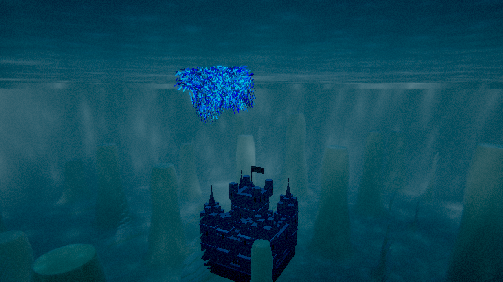

# 1. Введение

## 1.1. Что моделируется

Мы моделируем **стаю** — множество простых объектов (агентов), у каждого из которых нет
«начальника» и нет общего плана. Каждый агент видит только соседей вокруг себя и по трём простым
правилам решает, куда лететь (правила Бойдса, 1987). Из этих локальных правил возникает сложное
коллективное поведение: стая собирается в одно облако, летит в одном направлении, огибает
препятствия.

Проект показывает два мира, для которых правила одни и те же, а параметры разные:

* **Рыбы** — небольшой мир (пруд/риф) 320 × 140 × 320 м, радиус обзора 3.5 м, скорость до 14 м/с.
* **Птицы** — большой мир 1200 × 440 × 1200 м, радиус обзора 14 м, скорость до 32 м/с.

## 1.2. Цель проекта

Полностью GPU-резидентная симуляция роя, два режима (подводный биолюминесцентный и небесный с
процедурными биомами), интерактив курсором-лучом (аттрактор/репеллер), огибание препятствий через
SDF и HDR-постобработка. Требование к производительности — держать 100 000 агентов; CPU за кадр не
перебирает агентов в цикле.

Целевое железо по плану — Linux + NVIDIA (RTX 4060 Ti, Vulkan), основной таргет 1440p. В отчёте
отдельно оговорено, где числа измерены: часть замеров сделана на машине разработки (встроенная
графика), часть — на доступной карте NVIDIA GeForce GTX 1650.

## 1.3. Стек технологий

| Технология | Зачем |
|---|---|
| **Rust** | Язык проекта. Быстрый, безопасный по памяти, без сборщика мусора |
| **wgpu** | Слой над видеокартой (Vulkan / Metal / D3D12 / OpenGL / WebGPU) |
| **WGSL** | Язык шейдеров (программ для GPU) |
| **winit** | Создание окна и обработка ввода |
| **glam** | Векторная и матричная математика (`Vec3`, `Mat4`) |
| **bytemuck** | Безопасная передача структур в память GPU |

Главная идея: **всё, что можно, делается на GPU**. Видеокарта выполняет тысячи простейших
операций одновременно, а у нас 100 000 агентов, и для каждого нужно найти соседей и посчитать силы —
идеальная задача для параллельной обработки.

## 1.4. Ключевые числа

| Что | Значение |
|---|---|
| Агентов по умолчанию | 100 000 |
| Крейтов в проекте | 5 (`boids-core`, `boids-gpu`, `boids-scene`, `boids-render`, `boids-app`) |
| Сетка пространства (мир рыб) | 91 × 40 × 91 ячейка = 331 240 |
| Стадий битонной сортировки при 100k | 153 (массив 131 072 ключей) |
| Соседних ячеек, которые обходит агент | 27 (3×3×3) |
| Шагов sphere tracing океана | до 80 |
| Октав шума для рельефа | 4 (+ domain warping) |
| Замок-ориентир | 2 748 треугольников, 7 материалов |
| Переключение мира | `TAB`, морфинг агентов 1.5 секунды |

## 1.5. Что здесь «3D-моделирование»

* процедурная генерация геометрии (рельеф, деревья, тела агентов, замок) в коде;
* работа с матрицами камеры, проекцией, нормалями, освещением;
* уровни детализации и оптимизация (half-res, culling, instancing, vertex pulling);
* правильная намотка треугольников и отсечение задних граней;
* материалы: albedo, нормали, свечение, туман и атмосферная перспектива;
* постобработка изображения (bloom, тонмаппинг, хроматическая аберрация).
