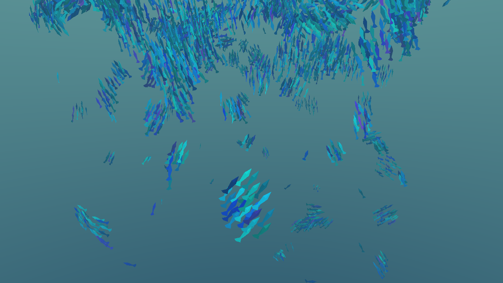
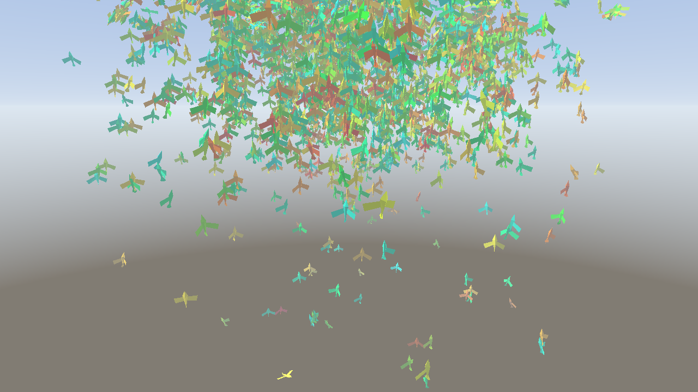

# 3. Этап 1 — каркас и наивный рой

**Задача этапа:** поднять рабочий конвейер от данных до пикселя на минимальной, но честной основе.

## 3.1. Что сделано

* Workspace из 5 крейтов; `boids-core` без зависимости от `wgpu`.
* Контракт раскладки GPU-структур: `const`-ассерты на размеры/выравнивание и **device-тест**,
  который сверяет смещения полей в WGSL с Rust `offset_of!`.
* CPU-эталон шага симуляции (`reference::step_cpu`, наивный O(N²)); GPU сходится с ним поштучно за
  один шаг и по агрегатам за сотни шагов.
* Симуляция целиком на GPU: ping-pong буферы агентов, один compute-проход на кадр, CPU не
  перебирает агентов.
* Instanced-рендер: меш и базис ориентации агента считаются прямо в вершинном шейдере по
  `vertex_index` и вектору скорости — **ни vertex buffer, ни instance buffer нет** (vertex pulling).
* Оба мира: процедурный фон, параметры меша и среды под режим, переключение по `TAB` без
  переаллокаций.
* Интерактив курсором: аттрактор, репеллер с закруткой, временный override на средней кнопке.
* Headless-скриншоты в PNG (`--screenshot`) и первые тесты на пиксели и глубину кадра.
* Документация: README, architecture, gpu-pipeline, math, perf, ADR-0001/0002.

## 3.2. Как это выглядело

Первый этап — это уже летающая и ориентирующаяся по скорости стая, но окружение ещё «плоское»:
однотонный градиентный фон и простая земля. Именно здесь видно, что рой живёт: тела наклоняются по
направлению движения, цвет берётся из палитры по `color_seed`.

## 3.3. Итог этапа

Получен сквозной вертикальный срез «данные → compute → instanced-рендер → картинка». Дальше
наивный поиск соседей `O(N²)` заменяется пространственной сеткой, потому что при 100k он
неприемлем.
