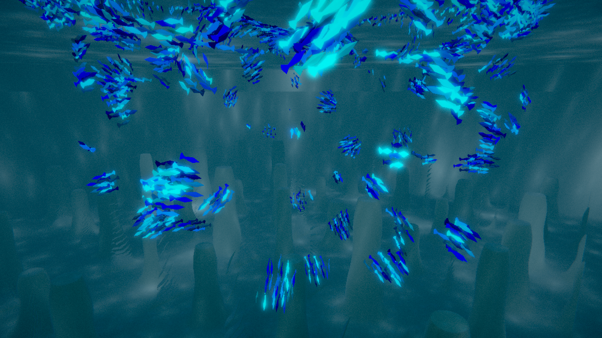
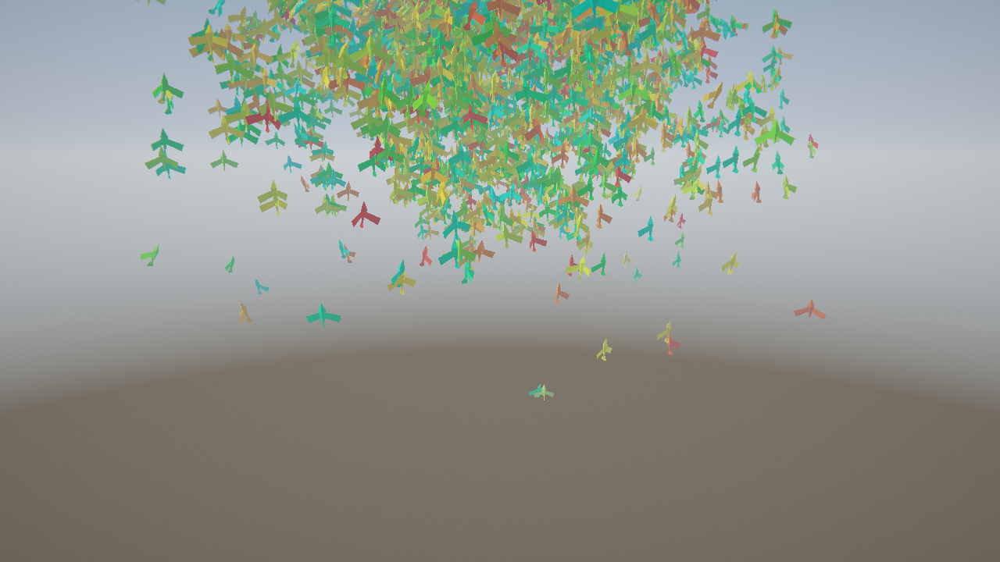

# 5. Этап 3 — курсор, SDF-огибание, подводный мир и HDR

**Задача этапа:** сделать сцену интерактивной, дать стае препятствия и получить первый «настоящий»
объёмный мир с постобработкой.

## 5.1. Интерактив курсором

Курсор строит луч из экранных координат (`ray_from_ndc`), пересекает его с плоскостью взгляда и
получает **точку фокуса** (`ray_plane_intersect`). Агенты либо притягиваются к ней, либо
отталкиваются с закруткой вокруг вертикальной оси. Средняя кнопка даёт временный override, не меняя
выбранный режим. Точка фокуса рисуется в окружении и перекрывается тем, во что попал raymarch —
тест `render/focus_marker_is_visible`.

## 5.2. Огибание препятствий через SDF

Препятствия описаны **функцией знакового расстояния** (SDF): по точке пространства она возвращает
расстояние до поверхности, знак говорит, внутри мы или снаружи. Нормаль берётся как градиент SDF
центральными разностями, а сила избегания — через `smoothstep`, который плавно включает силу и
насыщается (агент не «выстреливает» при касании). Дополнительно работает **предиктивный зонд**:
агент «смотрит» вперёд по своей скорости и при опасности не тормозит, а огибает препятствие.

Главное свойство: **одна и та же формула поля** используется и для отрисовки, и для симуляции.
Проверка `sdf/wgsl_matches_rust` сравнивает CPU-двойник поля с шейдером на сетке 32³ с точностью
`|Δ| < 1e-4` — поэтому рыба не может пройти сквозь нарисованную колонну.

## 5.3. Подводный мир (raymarching)

Риф — бесконечное процедурное поле повторяющихся колонн, а не готовая модель: колонн бесконечно
много, а SDF стоит несколько арифметических операций и **ноль видеопамяти**. Изображение считается
**лучом на каждый пиксель** (sphere tracing, до 80 шагов). В альфа-канал пишется пройденная
дистанция, из неё восстанавливается глубина, поэтому рыбы корректно перекрываются рифом — плывут
«за» колоннами.

Шейдинг воды имитирует реальное поглощение: **закон Бугера–Ламберта–Бера** по каналам (красный
поглощается первым, поэтому вода голубая), каустика на дне, god rays и биолюминесценция рыб.
Тесты `render/ocean_writes_depth` и `render/underwater_is_blue_and_lit`.

## 5.4. HDR, bloom и тонмаппинг

Геометрические проходы пишут в **HDR**-таргет `Rgba16Float` (яркости могут быть больше 1).
Bloom строится пирамидой уменьшенных копий (1/2, 1/4, 1/8): порог оставляет яркие пиксели, копии
складываются обратно (upsample) в мягкое свечение. Финальный **композит** делает хроматическую
аберрацию, экспозицию, добавление bloom, ACES-тонмаппинг, виньетку, грейд и киношное зерно.
Проверка `render/bloom_adds_light` следит, что пирамида реально добавляет свет.

Небесный мир на этом этапе ещё старый (плоская земля), поэтому он выглядит как на Этапе 1.

## 5.5. Итог этапа

Появился объёмный подводный мир с честным поглощением света и свечением, интерактив курсором и
огибание препятствий. Самый дорогой проход (raymarch) вынесен в half-res с full-res resolve,
который записывает глубину, — это примерно вчетверо дешевле по пикселям.
