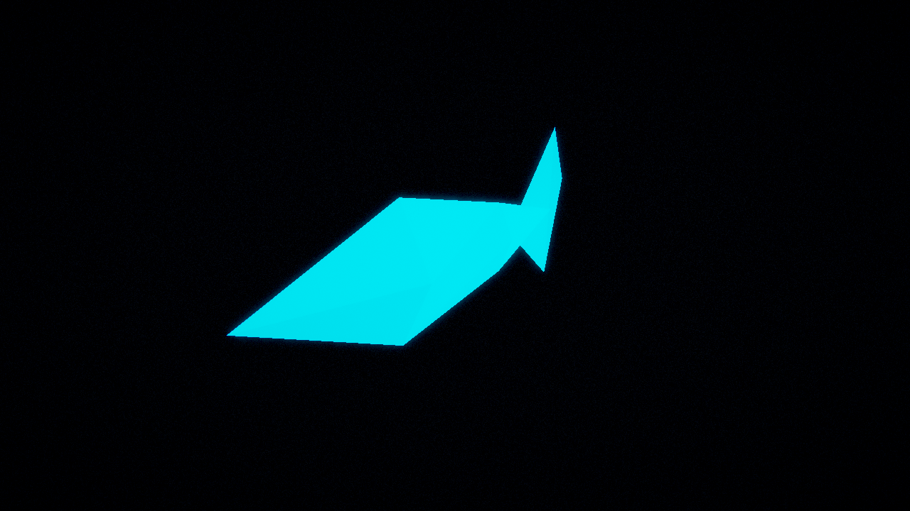
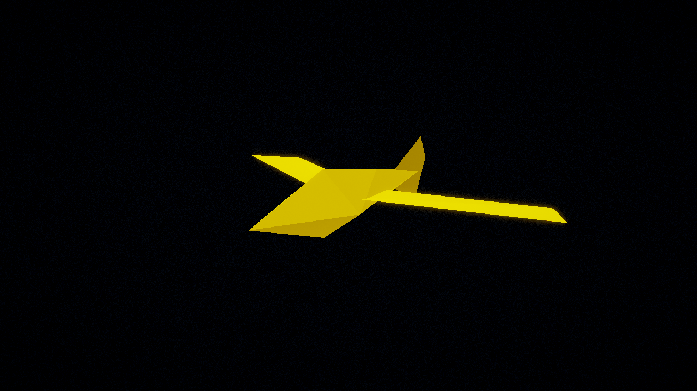
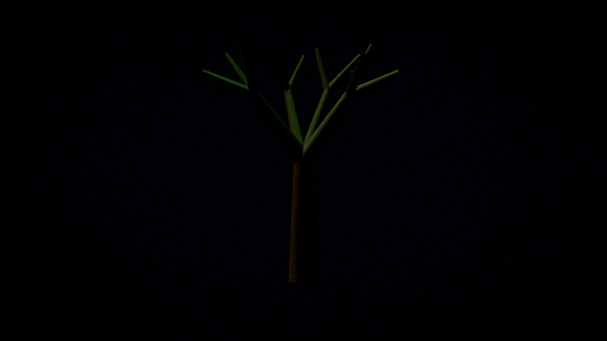
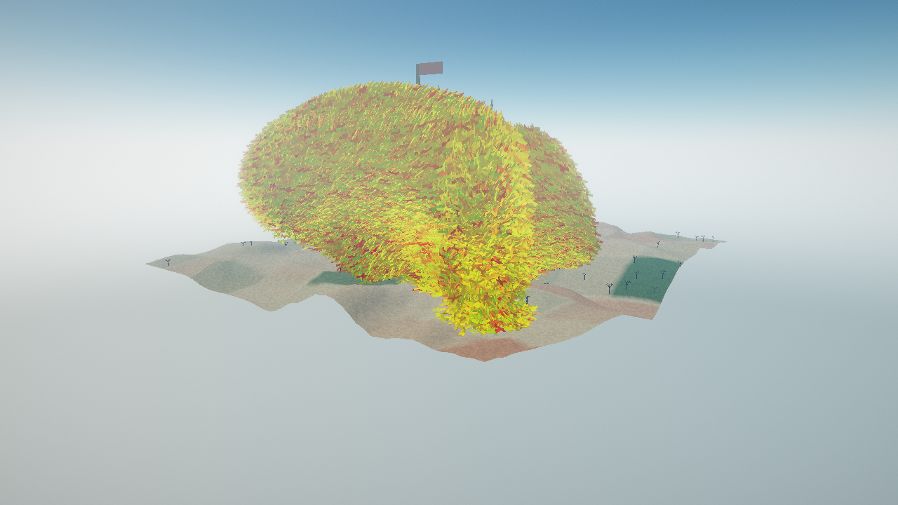
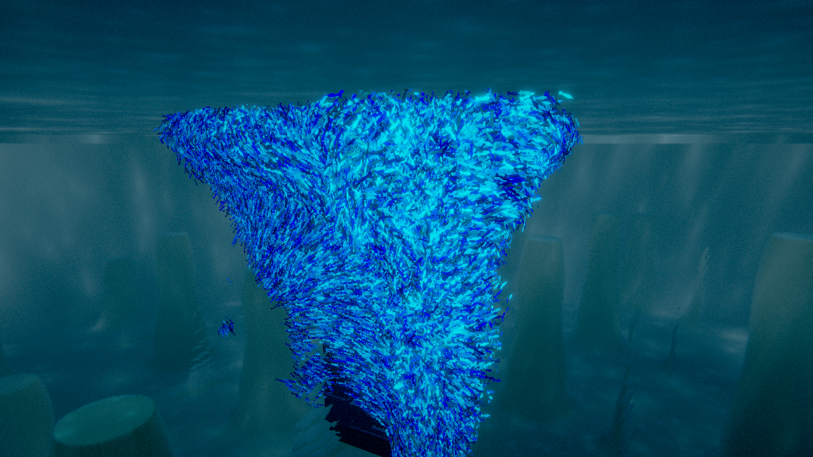

# 6. Этап 4 — рельеф, биомы, атмосфера, морфинг и замок

**Задача этапа:** превратить небесный мир в полноценный процедурный ландшафт, добавить морфинг
между мирами и добить визуальную полировку.

## 6.1. Рельеф и биомы

Рельеф — не текстура и не готовая модель, а математическая функция от координат. Сначала он
«запекается» в текстуру высот (`Rgba32Float`) вычислительным проходом, во втором канале хранится
маска биома. Затем меш-сетка читает эту карту (vertex pulling) и рисуется одним draw-вызовом.

* **шум:** value noise с интерполяцией Эрмита, **4 октавы** (f, 2f, 4f, 8f с амплитудами 1, ½, ¼, ⅛)
  и **domain warping** — сдвиг координаты другим шумом, который превращает «шишки» в хребты и долины;
* **три биома** (лес / дюны / каньон) — это **разбиение единицы**: три веса, сумма которых равна 1,
  поэтому переходы плавные, без швов. Высоты, цвет и растительность считаются из одних и тех же
  весов и не могут «разойтись»;
* **нормали** — центральные разности соседних текселей, поэтому освещение совпадает с формой;
* **деревья** — compute-scatter по blue-noise с учётом маски биома; меш генерируется один раз на CPU
  (фрактальная ветвящаяся структура, 136 треугольников) и рисуется instanced.

## 6.2. Аналитическая атмосфера

Небо считается по упрощённой модели **однократного рассеяния света**: два типа частиц — Рэлей
(молекулы воздуха, голубые) и Ми (аэрозоль, рассеивает вперёд), оптическая толщина вдоль луча,
закон Бугера–Ламберта–Бера и фазовые функции. Из этой модели сами собой получаются голубое небо,
бледный горизонт и ореол вокруг солнца. Тот же расчёт даёт `aerial_perspective` — далёкий рельеф
«тонет» в дымке.

## 6.3. Морфинг между мирами

При нажатии `TAB` форма, анимация, свечение и палитра агентов **линейно интерполируются** за 1.5
секунды между параметрами рыб и птиц (`mix(параметры_рыбы, параметры_птиц, t)`). Так как форма агента
процедурная, «превращение» не требует двух моделей — достаточно плавно менять числа. Переключение не
трогает устройство и поверхность: созданы оба мира заранее, меняется только активный pipeline.

## 6.4. Замок-ориентир

В обоих мирах стоит процедурный замок — хост-меш, который рисуется instanced. Место под него ищется
поиском на CPU: в небесном мире — самый ровный участок, под водой — самая чистая вода на дне. Поиск
использует CPU-двойники полей рельефа и рифа, поэтому нарисованный замок не может оказаться внутри
холма или колонны. Подробная проработка замка — в отдельном разделе.

## 6.5. Вьюер моделей

Клавишей `v` (или флагом `--model fish|bird|tree|castle`) открывается студия, где одна модель
рисуется **через те же проходы и постобработку**, что и мир. Это гарантирует, что скриншот модели не
разъедется с тем, что реально рисует сцена.

## 6.6. Масштаб: 100 000 агентов

Уже на этом этапе целевые 100k агентов держатся в одном связном флоке (см. раздел о тестировании).

## 6.7. Итог этапа

Небесный мир стал полноценным процедурным ландшафтом с тремя биомами и атмосферой, появился
морфинг между мирами, замок-ориентир и вьюер моделей. На этом спринт из четырёх этапов завершён;
дальнейшая работа (в частности детальная проработка замка) описана отдельно.
