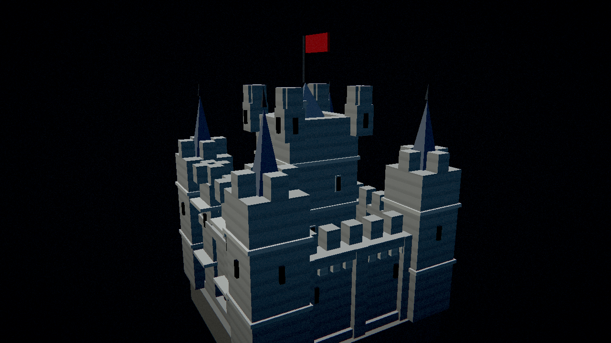

# 7. Отдельно: процедурный замок-ориентир

Замок — самый «модельный» объект проекта: это уже не процедурное поле, а настоящая собранная
геометрия с семью материалами. В этой сессии он был существенно доработан, поэтому вынесен в
отдельный раздел.

## 7.1. Как устроен замок

Замок — это **хост-меш**: он собирается на CPU из примитивов (коробок и пирамид) в
`crates/boids-scene/src/mesh.rs` и рисуется одним instanced-вызовом шейдером
`shaders/render/landmark.wgsl` через буфер инстансов (binding 9). Такой подход выбран потому, что
силуэт замка — это набор прямых рёбер, и фрактал (как у дерева) сгладил бы именно те детали, по
которым замок узнаётся.

Ключевые свойства меша:

* **Нормализация:** высота над «линией земли» приводится к 1.0, поэтому масштаб инстанса — это
  буквально высота замка в метрах. Основание (плита) уходит **ниже** `y = 0` — этот «передник»
  зарывает фундамент на склоне, чтобы замок не парил на низкой стороне.
* **Материалы:** каждый треугольник несёт номер материала, который шейдер превращает в цвет:
  камень, сланец (крыши), скала (плита), железо (решётка, флаговый шпиль), ткань (флаг), окно
  (бойницы) и **тёсаный камень** (пояски, наличники, консоли). Это один меш и одна палитра вместо
  семи отдельных мешей.
* **Плейсмент:** место ищется поиском по CPU-двойникам полей рельефа и рифа — самый ровный участок
  в небесном мире и самая чистая вода на дне под водой.

## 7.2. Найденный и исправленный дефект: стены рисовались с двух сторон

В `push_box` грань отодвигалась от центра по формуле `centre + normal * normal.dot(half)`. На
отрицательных гранях (−X/−Y/−Z) скалярное произведение отрицательно, и такая грань уезжала на
**положительную** сторону: коробка схлопывалась на три положительные плоскости и **была открыта с
трёх других**. Отсечение задних граней делало эти стены невидимыми — но только снаружи. Исправление —
`.abs()` в множителе. Регрессионный тест `push_box_closes_on_all_six_sides` проверяет **позиции**
всех шести граней (проверка намотки этот баг не ловит, потому что каждая грань намотана к своей
нормали корректно).

## 7.3. Что добавлено в этой сессии

| Деталь | Что это | Новый код |
|---|---|---|
| Шпили угловых башен | уходящие вверх пирамиды с железным шпилем, отступившие от зубцов | `push_pyramid` (с центром), `push_finial` |
| Пояски (string courses) | тонкие полосы тёсаного камня по башням и донжону, делят стену на «этажи» | `push_course` |
| Консольный пояс | ряд кронштейнов под машикулями стены — «зубчатая» линия тени | `push_corbel` |
| Наличники окон | обрамление вокруг бойниц донжона | `push_window` |
| Труба на крыше | дымоход и его оголовок на кровле донжона | константы `CASTLE_CHIMNEY_*` |
| Материал «trim» | светлее и теплее кладки — чтобы поясок/обрамление читались | `MATERIAL_TRIM`, палитра в `landmark.wgsl` |

Дополнительно поднят масштаб замка (примерно втрое, `CASTLE_HEIGHT_FRACTION = 1.02`) и изменён
плейсмент: замок теперь стоит **в центре мира** (`CASTLE_SITE = [0, 0]`), а не со смещением.
Меш вырос с 2 068 до **2 748 треугольников** (6 204 → 8 244 вершин), оставаясь в бюджете, который
держит тест.



## 7.4. Экспорт модели

Меш можно выгрузить в формат **Wavefront OBJ** — флаг `--export-castle <путь>`. Функция
`write_obj` пишет позиции, плоские нормали и по одной группе `usemtl` на материал. OBJ выбран
потому, что у нас именно позиции, плоские нормали и горстка материалов — ровно то, что OBJ хранит
нативно и что импортирует любой DCC-инструмент или движок без библиотек. Меш пишется в той же
нормализованной системе координат, что и рисуется, поэтому `y = 0` — линия земли, а верх — `y = 1`.

```bash
./target/release/boids --export-castle out/castle.obj
```

## 7.5. Как замок проверяется

* `castle_faces_wind_toward_their_normals` — намотка каждого треугольника согласована с его нормалью
  (иначе отсечение задних граней вырезает стену);
* `the_castle_is_normalized_around_its_ground_line` — верх ровно на `y = 1`, фундамент ниже нуля, а
  габарит совпадает с `CASTLE_HALF_EXTENT`, по которому ищется место;
* `push_box_closes_on_all_six_sides` — регрессия на баг со стенами;
* `the_castle_is_generated_deterministically` — две сборки меша побайтово совпадают и число
  треугольников в разумном бюджете;
* `render/landmark_is_drawn` — рендер-проверка: смена ракурса замка реально меняет пиксели кадра.
